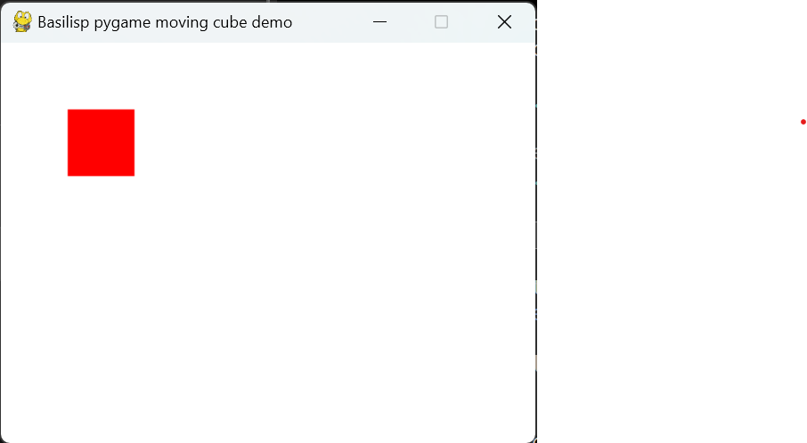

# Example Basilisp Project for getting started with `pygame`

## Overview

This project template is designed to help you quickly get started using the [pygame](https://www.pygame.org) library with [Basilisp](https://basilisp.readthedocs.io/en/latest/index.html).

The project uses the [Poetry](https://python-poetry.org/) tool to simplify Python dependency management and handle virtual environments. For installation details, see the [Poetry introduction guide](https://python-poetry.org/docs/).

## Project Anatomy

```
.
├── poetry.lock              (1)
├── pyproject.toml           (2)
├── src
│   └── basilex_pygame       (N)
│       └── demo.lpy         (3)
└── tests
    └── __init__.py
    └── basilex_pygame       (N)
        └── test_demo.lpy    (4)
```

🄝 The project's namespace.

① A lock file generated by Poetry that records the exact versions of dependencies installed.

② The configuration file where project metadata, dependencies, and Poetry settings are defined.

③ The `pygame` demo source code.

④ A unit test for the demo code.

## Project Setup

Before running the project for the first time, install the dependencies in a new virtual environment by running
```shell
poetry install
```

Next, activate the project's virtual environment for development with
```bash
poetry shell
```

## Usage

Check the example code in [src/basilex_pygame/demo.lpy](src/basilex_pygame/demo.lpy), which creates a `pygame` window with a cube that can be moved using the cursor keys.



To interact with Python code from Basilisp, you might want to familiarize yourself with [Basilisp's Python Interop features](https://basilisp.readthedocs.io/en/latest/pyinterop.html).

## Running and Developing the Code

The following steps assume you are using the [`basilisp` CLI tool](https://basilisp.readthedocs.io/en/latest/cli.html) within the activated virtual environment.

### Command Line
To load the namespace and run the demo, use the `run -n` option

```shell
basilisp run -n basilex-pygame.demo
```

### REPL
Start a REPL and run the code interactively with
```clojure
$ basilisp repl
basilisp.user=> (require '[basilex-pygame.demo :as d])
pygame 2.6.0 (SDL 2.28.4, Python 3.11.4)
Hello from the pygame community. https://www.pygame.org/contribute.html
nil
basilisp.user=> (d/run)
```

### nREPL Server

Start the nREPL server and connect to it using your favorite [Clojure enabled code editor](https://basilisp.readthedocs.io/en/latest/cli.html#start-an-nrepl-session). 
This will create an `.nrepl-port` file that your editor can use to connect to the server on a random port
```powershell
> basilisp nrepl-server
nREPL server started on port 57627 on host 127.0.0.1 - nrepl://127.0.0.1:57627
```

Alternatively, you can specify the port explicitly
```powershell
> basilisp nrepl-server --port 9999
nREPL server started on port 9999 on host 127.0.0.1 - nrepl://127.0.0.1:9999
```

## Testing

You can run the sample test located at [tests/basilex-pygame/test_demo.lpy](tests/basilex-pygame/test_demo.lpy) with

```bash
basilisp test
```

Happy coding with Basilisp!
