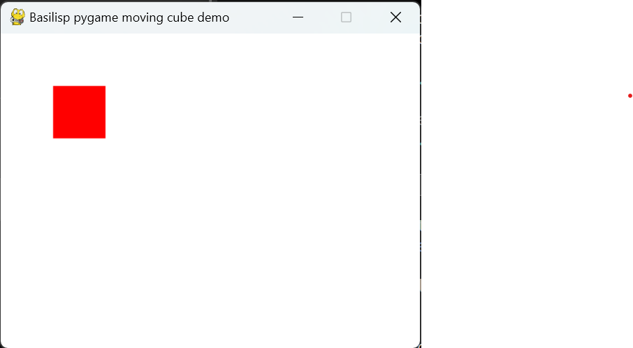

# Example Basilisp Project for getting started with `pygame`

[Basilisp](https://github.com/basilisp-lang/basilisp) is a Python-based Lisp implementation that offers broad compatibility with Clojure. For more details, check out the [documentation](https://basilisp.readthedocs.io/en/latest/index.html).

## Overview

This project template is designed to help you quickly get started uisng the [pygame](https://www.pygame.org) libray with Basilisp.

It uses the [Poetry](https://python-poetry.org/) dependency management tool. If you are not familiar with it, you may want to go through its [introduction material](https://python-poetry.org/docs/) to learn how to install the tool and use it.

Before running the project for the first time, you'll need to install it within a new virtual environment. To do this, run
```shell
poetry install
```

## Usage

First, ensure that you're in the project's virtual environment for development by running
```bash
poetry shell
```

Check the example code in [src/basilex_pygame/demo.lpy](src/basilex_pygame/demo.lpy), which creates a window with a cube that can be moved using the cursor keys.



To interact with Python code from Basilisp, you might want to familiarize yourself with [Basilisp's Python Interop features](https://basilisp.readthedocs.io/en/latest/pyinterop.html).

## Running and developing the code

### Command Line
Use the `basilisp` command line tool to load the namespace

```shell
basilisp run -n basilex-pygame.demo
```

### REPL
Start a REPL and run the code interactively
```clojure
$ basilisp repl
basilisp.user=> (require '[basilex-pygame.demo :as d])
pygame 2.6.0 (SDL 2.28.4, Python 3.11.4)
Hello from the pygame community. https://www.pygame.org/contribute.html
nil
basilisp.user=> (d/run)
```

### nREPL Server
Start the nREPL server and connect to it using your favorite Clojure enabled code editor. This will create an `.nrepl-port` file that your editor can use to connect to the server on a random port:
```powershell
> basilisp nrepl-server
nREPL server started on port 57627 on host 127.0.0.1 - nrepl://127.0.0.1:57627
```

Alternatively, you can specify the port explicitly
```powershell
> basilisp nrepl-server --port 9999
nREPL server started on port 9999 on host 127.0.0.1 - nrepl://127.0.0.1:9999
```

## Testing

You can run the sample test located at [tests/basilex-pygame/demo_test.lpy](tests/basilex-pygame/demo_test.lpy) you can run with

```bash
basilisp test
```

Happy coding with Basilisp!
